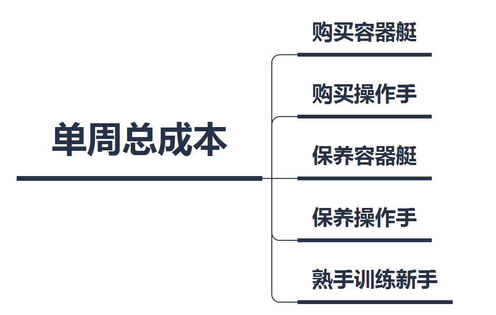
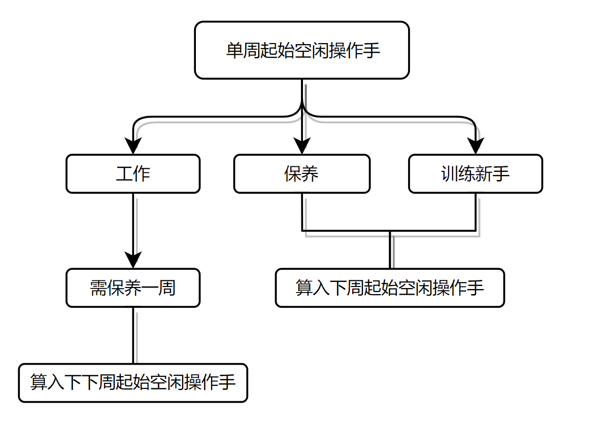
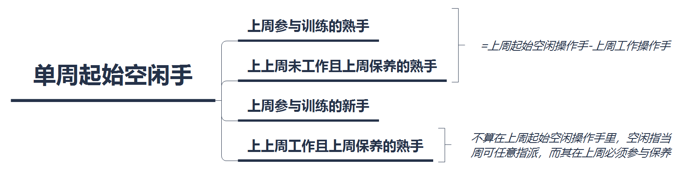
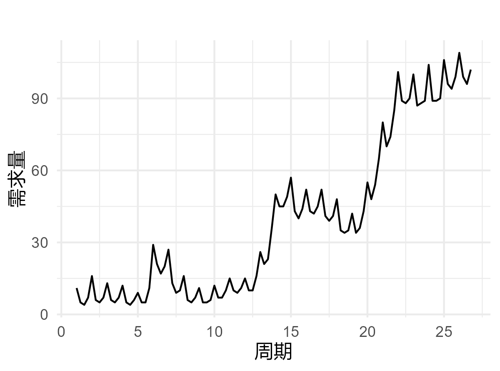

# 一、问题重述

某医院使用的血管机器人有两大特点：1. 可以组装。一个机器人由1个容器艇与4个操作手组成，操作手可以从容器艇上拆卸、安装与更换。2. 需要学习（训练）。每个新购买的操作手（新手）需要先在已学习好的操作手（熟手）指导下训练一周才能开始工作。

血管机器人工作时间为一周，之后必须取出其中的操作手进行为期一周的保养才能再次工作，如没有安排工作，则操作手一直需要保养。新购买的容器艇经过一周调试后才能工作，容器艇工作结束后可以连续使用而不保养，但如果不使用，那么容器艇也需要保养。假定购买的容器艇和操作手在每周开始时到货并立即安排调试和学习。相关成本数据见附件1。附件2是第1-104周该医院所需要的血管机器人数量。

该医院从第1周开始使用血管机器人，并在开始前已有了13个容器艇和50个熟练操作手。请建立数学模型，回答下列问题：

1. 每周开始时，医院可以购买到操作手和容器艇。每个熟手可指导10个新手训练，仅考虑第1-8周，求每周需要购买多少容器艇和操作手，使得既满足需求又达到成本最小化。

2. 每周有20%的机器人损毁（个数四舍五入取整），其他条件遵循问题1，通盘考虑第1-104周，求共需要购买多少容器艇和操作手，使得既满足需求又达到成本最小化。将相关结果填入表1。并将问题2第1-8周的结果数据与问题1的结果数据进行对比分析。

3. 每个熟手可指导的新手数调整为20个，且每周机器人损毁比例变为20%（个数四舍五入取整），其他条件遵循问题2，求第1-104周总共需购买多少容器艇和操作手，使满足需求与成本最小化。将相关结果填入表2。

4. 操作手与容器艇的购买有优惠。容器艇一次购买不超过5个时单价为200元/个；一次性购买超过5个但不超过10个时，超过部分单价为180元/个；一次性购买超过10个时，超过部分单价为160元/个。操作手一次购买不超过20个时单价为100元/个；一次性购买超过20个但不超过40个时，超过部分单价为90元/个；一次性购买超过40个时，超过部分单价为80元/个。其他条件遵循问题3，求第1-104周共需购买多少容器艇和操作手，使满足需求与成本最小化。将相关结果填入表3。

5. 首先，预测第105-112周的血管机器人需求；其次，比较以下两种方案的第1-112周最低运营成本差额。

   方案1：在第1-104周最优结果基础上，第105周开始时有可能需要以每个300元购买能够直接使用的容器艇和每个150元购买熟练操作手，而后续每周价格均按问题4中优惠政策计算。

   方案2：通盘考虑第1-112周的血管机器人需求。

# 二、问题分析

血管机器人的订购与生物学习问题给出了相关成本和第1-104周机器人需求数量数据，共五小问，每个小问的条件稍有不同，但求解目的都是相似的，即要求规划每周的容器艇和操作手购买数目，使得既满足要求又成本最小化。因此，适合对该题目进行规划建模，将题目给出的每个条件转化为一系列模型约束条件，然后求解最小成本的目标函数。针对不同的小问，只需对相应约束条件做少量修改，最后求解最小成本即可。

## 问题1：第1-8周的成本最小规划

问题1要求在即满足第1-8周需求又成本最小化的前提下，求解每周购买容器艇数和操作手数。其属于规划问题，在建立的模型中，**目标函数**为最小成本，**约束条件**为包括满足医院需求以及其他题目给定条件。具体的，需考虑其他条件包括：1. 每个容器艇由4个操作手组成；2. 新购买的操作手必须先经熟手训练，训练时间为一周；3. 容器艇可以连续工作，但不工作需要保养；4. 操作手工作后需保养一周，且不工作也需保养；5. 初始已有13个容器艇和50个熟手。

这些条件是总题目给出的。在此基础上，问题1增补假设：可以在每周开始时购买到容器艇和操作手，另增补了条件：每个熟手单周能训练的最大新手数为10个。在建模中，只需把以上这些条件转化为数学语言的模型约束条件，然后求解最小成本的目标函数即可。

## 问题2：损毁条件下的第1-104周成本最小规划

问题2在问题1的条件基础上，增加了每周损毁20%血管机器人的条件。求解目标类似，同问题1都是求解最小成本，问题2只是将求解范围从第1-8周扩充到了1-104周。对于新增的损毁条件，由于单个机器人由1个容器艇和4个操作手组成，所以每周损毁20%机器人就相当于每周损失20%当周工作容器艇及操作手。转换到建模数学语言上，只需对涉及到容器艇及操作手数量的约束条件进行修改，其余约束条件以及目标函数相对问题1模型不必做出修改，便可作为本题的最终模型。

另外，题目还要求将问题2第1-8周求解结果与问题1相应结果进行对比分析，即要求比较有无损毁条件下的两结果相应指标大小，对其进行总结。

## 问题3：修改问题2条件数值的第1-104周成本最小规划

问题3与问题2的不同之处仅在于其机器人每周工作损毁比例从20%修改为了10%，每个熟手每周可训练的新手数从10个变为了20个，而求解目标不变。因此仅修改问题2模型的部分参数即可求解出问题3模型。

## 问题4：修改问题2条件数值的第1-104周成本最小规划

问题4在问题3的基础上增加了打折优惠条件，求解目标仍为第1-104周最小成本。打折优惠仅针对容器艇以及操作手的购买，特点是根据购买数量的不同而有不同打折力度。因此对于问题4模型的建立，只需在问题3模型基础上更改相应价格约束条件为分段函数约束即可。

## 问题5：第105-112周的需求预测及两种方案的成本研究

首先，问题5要求对第105-112周（共8周）的机器人需求进行预测。由于题目背景为医院使用血管机器人进行医疗工作。故未来8周的机器人的需求只能通过前面第1-104周机器人需求变化的规律进行预测。自然，对第1-104周的机器人需求数据进行可视化分析，然后依照其变化规律建立适合的预测模型是一种可行的思路。

其次，问题5要求分别求解给定两种方案的第105-108周机器人使用成本。其中，方案2预设条件相对简单，仅仅是对问题4求解范围的扩充，因此针对方案2，只需修改问题4模型的范围参数即可求解出结果。而方案1则相对复杂，对于第1-112周的机器人使用成本，需分三个阶段讨论，分别为：第1-104周、第105周和第106-112周。其中题目要求第1-104周使用问题4的求解结果。建模方面，在问题4模型的基础上，对其约束条件进行分阶段设定，然后再修改求解范围即可求解出结果。

最后，题目要求比较两种方案第1-112周最低运营成本的差额。

# 三、模型假设

本文基于以下假设进行建模求解：

假设1：新购买容器艇的调试不消耗成本；

假设2：熟手指导新手训练完毕后，下周可直接投入工作；

假设3：工作的最后一周也需考虑容器艇和操作手的保养。

假设4：在问题5方案1中，第105周只能以每个300元和每个150元的价格购买可直接使用的容器艇和熟练操作手，而不能与原价购买进行组合搭配。

# 四、符号说明

| 符号       | 说明                        | 单位 |
| ---------- | --------------------------- | ---- |
| $x_{i}$    | 第$i$周起始空闲操作手数     | 个   |
| $y_{i}$    | 第$i$周起始空闲容器艇数     | 个   |
| $z_{i}$    | 第$i$周需求机器人数         | 个   |
| $a_{i}$    | 第$i$周训练新手的熟手数     | 个   |
| $b_{i}$    | 第$i$周购买并训练的新手数   | 个   |
| $c_{i}$    | 第$i$周购买并调试的容器艇数 | 个   |
| $p_{i}$    | 第$i$周保养操作手数         | 个   |
| $q_{i}$    | 第$i$周保养容器艇数         | 个   |
| $o_{i}$    | 第$i$周训练操作手数         | 个   |
| $w_{i}$    | 第$i$周总成本               | 元   |
| $W_i$      | 第1-$i$周总成本             | 元   |
| $s_{i}$    | 第$i$周机器人损毁数         | 个   |
| $u_{i}$    | 第$i$周购买容器艇的总成本   | 元   |
| $v_{i}$    | 第$i$周购买操作手的总成本   | 元   |
| $k$        | 在不同问题中的损耗比xxxxx   | -    |
| $round(x)$ | 代表对$x$进行四舍五入取整   | -    |

# 五、模型建立与求解

## 问题1的模型建立与求解

本问要求求解第1-8周的最小成本规划，本文将对问题所给条件进行解构分析，建立目标函数为最小化成本的线性规划模型，基于一系列约束条件，求解模型得出结果。

### 建模前的条件解构

**a. 单周总成本构成**

由题目条件及附件1相关成本表，可知单周总成本共由五个部分的总成本组成：购买容器艇总成本、购买操作手总成本、保养容器艇总成本、保养操作手总成本以及熟手训练新手总成本。其可视化思维导图如 @fig-单周总成本的组成

{#fig-单周总成本的组成 width=45% height=18.5%}

**b. 单周起始空闲操作手的三种指派情况**

定义单周起始“空闲”操作手为每个单周开始时可任意指派的熟练操作手，那么分析题目描述可知其当周可被指派的方向共有三个，分别为：参与工作、不工作而参与保养以及训练新操作手。当周参与工作的操作手下周必须保养，未参与工作的下周可以则被任意指派。其可视化流程图如 @fig-三种指派情况

{#fig-三种指派情况 width=60% height=28%}

**c. 单周起始空闲操作手的组成**

由于每个操作手工作后必须保养一周，故操作手当周工作完毕后，因其保养具有强迫性，故其不算在下周的空闲操作手之内，而是算作下下周的空闲操作手。结合上一小节(c)对空闲操作手指派情况的分析，可知单周起始空闲操作手共由四个部分组成：1. 上周参与训练的熟手；2. 上周参与训练的新手；3. 上上周未工作且上周保养的熟手；4. 上上周工作且上周保养的熟手。其中1和3的数量和等于上周起始空闲操作手数减去上周工作操作手数（参考 @fig-三种指派情况 ）。其可视化思维导图如 @fig-空闲操作手组成

{#fig-空闲操作手组成 width=95% height=15%}

**d. 基于最小成本的部分条件简化及分析**

由于新购买的操作手需要训练，若不训练则无法投入工作，所以对于操作手来说，只购买而不训练是没有意义的，即当周购买的操作手应该当周就开始训练，否则可能增加无必要的储存开销。所以操作手的购买—训练两个步骤在建模中可以合并作一步而不影响最终结果，即合并称作“购买并训练”。

同理，容器艇如果只购买而不调试，或者前一周调试完成而当周却不投入使用都是没有意义的，只会徒增额外的时间与金钱开销。所以容器艇的购买—调试同样可以合作一步，即“购买并调试”。在当周购买并调试完毕后，其就将会成为下周起始空闲容器艇。所以单周起始空闲容器艇包括两部分：上周空闲的容器艇和上周购买并调试的容器艇。

### 模型的建立与求解

由问题一的分析以及前文所述的条件解构，建立以最小成本为目标函数的整数线性规划模型。

**a. 目标函数的确定**

在问题一模型中，若无特别声明，均有$i=1,2,\dots,8$。

记$W_i$为第1-$i$周总成本，$w_i$为第$i$周单周总成本，则第1-8周的总成本可表示为：

$$
W_8=\sum_{i=1}^8w_i
$$ {#eq-模型一目标函数}

**b. 约束条件的确定**

设第$i$周起始空闲操作手数为$x_i$，第$i$周需求机器人数为$z_i$，条件：每个机器人需搭配4个操作手，所以第$i$周需求操作手数可用$4z_i$来表示。由于为满足任务需求，第$i$周起始空闲操作手数$x_i$应大于需求操作手数$4z_i$，该条件可转化为数学形式的不等式约束：

$$
4z_i\leqslant x_i
$$ {#eq-空闲手大于需求手}

设第$i$周起始空闲容器艇数为$y_i$，条件：每个机器人需要一个容器艇，所以第$i$周需求容器艇数可用需求机器人数$z_i$来表示。同样，第$i$周起始空闲容器艇数应大于需求容器艇数$z_i$转化为不等式约束：

$$
z_i\leqslant y_i
$$ {#eq-空闲艇大于需求艇}

设第$i$周用于训练的熟手数为$a$，第$i$周购买并训练的新手数为$b_i$，条件：每个熟手单周能训练的新手数不超过10个，转化为不等式约束：

$$
b_i\leqslant 10a_i
$$ {#eq-熟手最多训练十名新手}

对于第$i$周起始空闲操作手数$x_i$的取值，需要分情况进行讨论：

1. 题目已给出初始熟手数为50个，即第1周起始空闲操作手$x_1=50$；

2. 第2周起始空闲操作手仅由第1周参与训练的熟手$a_1$以及购买并训练的新手$b_1$组成，而第1周参与训练的熟手数$a_1$可由第1周起始空闲操作手数$x_1$与第1周需求操作手数$z_1$（四倍需求机器人数）相减得出。故第2周起始空闲操作手$x_2=x_1-4z_1+b_1$；

3. 第3-8周各周起始空闲操作手的组成已在前面小节做了分析，如 @fig-空闲操作手组成 。故当$i=3,4,\dots,8$时，有$x_i=x_{i-1}-4z_{i-1}+b_{i-1}+4z_{i-2}$。

综合以上三种情况，可得第$i$周起始空闲操作手数$x_i$的等式约束为：

$$
x_{i}=
  \begin{cases}
  50 ,\quad i=1 \\
  x_{i-1}-4z_{i-1}+b_{i-1},\quad i=2 \\
  x_{i-1}-4z_{i-1}+b_{i-1}+4z_{i-2},\quad i>2
  \end{cases}
$$ {#eq-空闲操作手}

对于第$i$周起始空闲容器艇数$y_i$的取值，同样需要分情况讨论：当$i=1$时，题目已给出$y_1=13$；当$i=2,3,\dots,8$时，记$c_i$为第$i$周购买并调试的容器艇数，由前文的解构分析，可知$y_i=y_{i-1}+c_{i-1}$。综合两种情况，第$i$周起始空闲容器艇数$y_i$的等式约束为：

$$
y_{i}=
  \begin{cases}
  13,\quad i=1 \\
  y_{i-1}+c_{i-1},\quad i>1
  \end{cases}\\
$$ {#eq-空闲容器艇}

记第$i$周保养操作手数为$p_i$，则第1周时，结合流程图 @fig-三种指派情况 ，可知$p_1=x_i-4z_i-a_i$；而对于其他周，则应另外将上周工作的操作手数（这周必须保养）纳入考虑，即对$i=2,3,\dots,8$，有$p_i=x_i-4z_i-a_i+4z_{i-1}$。综合两种情况，第$i$周保养操作手数$p_i$的等式约束为：

$$
p_{i}=
  \begin{cases}
  x_{i}-4z_{i}-a_{i},\quad i=1 \\
  x_{i}-4z_{i}-a_{i}+4z_{i-1},\quad i>1
  \end{cases}
$$ {#eq-保养操作手}

记第$i$周保养容器艇数为$q_i$，由当周保养容器艇数等于当周起始空闲容器艇数减去当周工作容器艇数，故有对于$q_i$的等式约束：

$$
q_i=y_i-z_i
$$ {#eq-保养容器艇}

记第$i$周训练操作手为$o_i$，易知对于$o_i$有等式约束：

$$
o_i=a_i+b_i
$$ {#eq-训练操作手}

对于第$i$周单周总成本，结合思维导图 @fig-单周总成本的组成 及附件1的相关成本表格，可得对于$w_i$的等式约束：

$$
w_{i}=200c_{i}+100b_{i}+5p_{i}+10q_{i}+10o_{i}
$$ {#eq-单周总成本}

**c. 优化模型汇总**

综上所述，第1-8周的最小成本整数线性规划模型汇总如下：

$$
\begin{aligned}
&\min \ W_8 = \sum_{i=1}^8w_{i}\\
&\text{s.t.}
\begin{cases}
4z_{i}\leqslant x_{i}\\
z_{i}\leqslant y_{i}\\
b_{i}\leqslant 10a_{i}\\
x_{i}=
  \begin{cases}
  50 ,\quad i=1 \\
  x_{i-1}-4z_{i-1}+b_{i-1},\quad i=2 \\
  x_{i-1}-4z_{i-1}+b_{i-1}+4z_{i-2},\quad i>2
  \end{cases}\\
y_{i}=
  \begin{cases}
  13,\quad i=1 \\
  y_{i-1}+c_{i-1},\quad i>1
  \end{cases}\\
  p_{i}=
  \begin{cases}
   x_{i}-4z_{i}-a_{i},\quad i=1 \\
    x_{i}-4z_{i}-a_{i}+4z_{i-1},\quad i>1
  \end{cases}\\
 q_{i}=y_{i}-z_{i}\\
o_{i}=a_{i}+b_{i}\\
w_{i}=200c_{i}+100b_{i}+5p_{i}+10q_{i}+10o_{i},\quad i\geqslant1\\
x_{i},\ y_{i},\ z_{i},\ a_{i},\ b_{i},\ c_{i},\ w _{i},\ p_{i},\ q_{i},\ o_{i}\in N^{*}\\
i=1,2,\dots,8
\end{cases}
\end{aligned}
$$ {#eq-模型一汇总}

**d. 模型的求解**

上述所建立模型属于整数线性规划模型，本文通过Julia编程语言调用GLPK开源求解器对其进行了求解，所得结果如 @tbl-模型一求解结果

| 周次          | 购艇 | 购手 | 保养手 | 保养艇 | 训练手 | 总成本 |
| ------------- | ---- | ---- | ------ | ------ | ------ | ------ |
| 第 1 周       | 0    | 14   | 4      | 2      | 16     | 1600   |
| 第 2 周       | 0    | 0    | 44     | 8      | 0      | 300    |
| 第 3 周       | 0    | 0    | 48     | 9      | 0      | 330    |
| 第 4 周       | 3    | 28   | 33     | 6      | 31     | 3935   |
| 第 5 周       | 0    | 0    | 28     | 0      | 0      | 140    |
| 第 6 周       | 0    | 0    | 68     | 10     | 0      | 440    |
| 第 7 周       | 0    | 0    | 72     | 11     | 0      | 470    |
| 第 8 周       | 0    | 0    | 64     | 9      | 0      | 410    |
| 1-8周（总计） | 3    | 42   | 317    | 55     | 47     | 7625   |

: 问题1的相关结果数据 {#tbl-模型一求解结果}

## 问题2模型的建立与求解

问题2在问题1的基础上增加了每周损毁20%工作容器艇与20%工作操作手的条件，并且扩大了需求解的范围。所以在问题1模型的基础上，只需对受损毁条件影响的约束条件进行修改即可得出问题2模型。

设第$i$周机器人损毁数用$s_i$表示，且符号$round(x)$代表对$x$进行四舍五入取整。由每周损毁20%工作机器人的条件，有：

$$
s_i=round(0.2z_{i})
$$ {#eq-模型二损毁数}

则第$i$周损毁容器艇数和损毁操作手数分别可用$s_i$和$4s_i$来表示。

### 建模前的条件解构

相对问题1，问题2的单周起始空闲操作手$x_i$、单周起始空闲容器艇数$y_i$和单周保养操作手$p_i$三者的组成成分皆发生了改变。下面针对这些改变进行详细描述：

**a. 单周起始空闲操作手的组成**

由于每周会损毁20%工作操作手，所以原上上周工作且上周保养的熟手$4z_{i-2}$在问题2条件下需增加“工作且未损毁”的前提才能算入单周起始空闲操作手$x_i$里，单手起始空闲手$x_i$的其余组成部分与问题1相同。其可视化思维导图如 @fig-问题二空闲操作手组成

{#fig-问题二空闲操作手组成 width=95% height=18.5%}

**b. 单周起始空闲容器艇的组成**

原问题1的单周起始空闲容器艇$y_i$仅由两部分组成：上周工作容器艇$y_{i-1}$和上周购买并调试容器艇$c_{i-1}$。在问题2条件下，上周工作容器艇在工作中可能被损毁，因此只有“存活”的部分才能算入本周起始空闲容器艇，而存活的部分在数量上等于上周起始空闲容器艇数$y_{i-1}$-上周工作损毁容器艇数$s_{i-1}$。

**c. 单周保养操作手的组成**

同b、c小节，单周保养操作手$p_i$的组成的上周工作操作手$4z_i$部分在问题2条件下应变为上周工作操作手$4z_i$-上周工作损毁操作手$4s_i$。

### 模型的建立与求解

结合前文所述的条件解构，问题2相对问题1所应进行修改的公式有([-@eq-空闲操作手])、([-@eq-空闲容器艇])和([-@eq-保养操作手])。应当进行的相应修改在条件解构中已作详尽描述，此处不加赘述地给出经过相应修改后$x_i$、$y_i$和$p_i$的数学约束式：

$$
x_{i}=
  \begin{cases}
  50 ,\quad i=1 \\
  x_{i-1}-4z_{i-1}+b_{i-1},\quad i=2 \\
  x_{i-1}-4z_{i-1}+b_{i-1}+4(z_{i-2}-s_{i-2}),\quad i>2
  \end{cases}
$$ {#eq-模型二空闲操作手}

$$
y_{i}=
  \begin{cases}
  13,\quad i=1 \\
  y_{i-1}+c_{i-1}-s_{i-1},\quad i>1
  \end{cases}\\
$$ {#eq-模型二空闲容器艇}

$$
p_{i}=
  \begin{cases}
  x_{i}-4z_{i}-a_{i},\quad i=1 \\
  x_{i}-4z_{i}-a_{i}+4(z_{i-1}-s_{i-1}),\quad i>1
  \end{cases}
$$ {#eq-模型二保养操作手}

在这三个修改的基础上，将问题1模型中约束$i=1,2,\dots,8$改为$i=1,2,\dots,104$，其他约束条件不变。再将目标函数变为：

$$
W_{104}=\sum_{i=1}^{104}w_i
$$ {#eq-模型二目标函数}

即可得出问题2模型，即在问题2条件下，第1-104周的最小成本整数线性规划模型汇总如下：

$$
\begin{aligned}
&\min \ W_{104} = \sum_{i=1}^{104}w_{i}\\
&\text{s.t.}
\begin{cases}
4z_{i}\leqslant x_{i}\\
z_{i}\leqslant y_{i}\\
b_{i}\leqslant 10a_{i}\\
x_{i}=
  \begin{cases}
  50 ,\quad i=1 \\
  x_{i-1}-4z_{i-1}+b_{i-1},\quad i=2 \\
  x_{i-1}-4z_{i-1}+b_{i-1}+4(z_{i-2}-s_{i-2}),\quad i>2
  \end{cases}\\
y_{i}=
  \begin{cases}
  13,\quad i=1 \\
  y_{i-1}+c_{i-1}-s_{i-1},\quad i>1
  \end{cases}\\
  p_{i}=
  \begin{cases}
   x_{i}-4z_{i}-a_{i},\quad i=1 \\
    x_{i}-4z_{i}-a_{i}+4(z_{i-1}-s_{i-1}),\quad i>1
  \end{cases}\\
 q_{i}=y_{i}-z_{i}\\
o_{i}=a_{i}+b_{i}\\
w_{i}=200c_{i}+100b_{i}+5p_{i}+10q_{i}+10o_{i},\quad i\geqslant1\\
x_{i},\ y_{i},\ z_{i},\ a_{i},\ b_{i},\ c_{i},\ w _{i},\ p_{i},\ q_{i},\ o_{i}\in N^{*}\\
s_i=round(0.2z_{i})\\
i=1,2,\dots,104
\end{cases}
\end{aligned}
$$ {#eq-模型二汇总}

问题2模型同问题1模型，也属于整数线性规划模型，使用求解器所解得结果如 @tbl-模型二求解结果

| 周次            | 购艇 | 购手 | 保养手 | 保养艇 | 训练手 | 总成本 |
| --------------- | ---- | ---- | ------ | ------ | ------ | ------ |
| 第 12 周        | 5    | 20   | 26     | 1      | 22     | 3360   |
| 第 26 周        | 0    | 0    | 100    | 9      | 0      | 590    |
| 第 52 周        | 21   | 128  | 59     | 0      | 141    | 18705  |
| 第 78 周        | 16   | 40   | 172    | 0      | 44     | 8500   |
| 第 101 周       | 12   | 80   | 308    | 0      | 88     | 12820  |
| 第 102 周       | 17   | 36   | 344    | 0      | 40     | 9120   |
| 第 103 周       | 25   | 92   | 306    | 0      | 102    | 16750  |
| 第 104 周       | 0    | 0    | 308    | 0      | 0      | 1540   |
| 1-104周（总计） | 879  | 3826 | 13066  | 131    | 4234   | 667560 |

: 问题2的相关结果数据 {#tbl-模型二求解结果}

为同问题1结果作比较，列出问题2第1-8周相关结果如 @tbl-模型二前八周结果

| 周次          | 购艇 | 购手 | 保养手 | 保养艇 | 训练手 | 总成本 |
| ------------- | ---- | ---- | ------ | ------ | ------ | ------ |
| 第 1 周       | 0    | 14   | 4      | 2      | 16     | 1600   |
| 第 2 周       | 0    | 0    | 36     | 6      | 0      | 240    |
| 第 3 周       | 0    | 0    | 36     | 6      | 0      | 240    |
| 第 4 周       | 8    | 44   | 15     | 2      | 49     | 6585   |
| 第 5 周       | 0    | 0    | 24     | 0      | 0      | 120    |
| 第 6 周       | 0    | 0    | 52     | 7      | 0      | 330    |
| 第 7 周       | 0    | 0    | 52     | 7      | 0      | 330    |
| 第 8 周       | 0    | 0    | 40     | 4      | 0      | 240    |
| 1-8周（总计） | 8    | 58   | 223    | 34     | 65     | 9685   |

: 问题2第1-8周的相关结果数据 {#tbl-模型二前八周结果}

经过对 @tbl-模型一求解结果 和@tbl-模型二求解结果 的对比，发现问题1与问题2的购艇、购手以及训练手的时间极其相似，都仅集中在第1周和第4周，且第1周两者三种指标无差别，第4周问题2结果数相较问题1结果数有全面地增加。而对于保养艇和保养手数量指标，问题2结果数则相较问题1结果数有全面地减少。同时，问题2模型第1-8周的总成本高于问题1模型。上述这些特性无疑与问题2新增损毁条件有密不可分的关系。

## 问题3模型的建立与求解

由于问题3条件与问题2条件几乎别无二致，仅每周机器人工作损毁比例变为20%，每周熟手训练最大新手数变为20个。两问题的求解目的相同。因此仅修改问题2模型相应约束条件的参数即可得出问题三模型。有所修改的约束条件为：

$$
b_{i}\leqslant 20a_{i}
$$ {#eq-模型三熟手训练新手数}

$$
s_{i}=round(0.1z_{i})
$$ {#eq-模型三损毁数}

问题3模型汇总如下：

$$
\begin{aligned}
&\min \ W_{104} = \sum_{i=1}^{104}w_{i}\\
&\text{s.t.}
\begin{cases}
4z_{i}\leqslant x_{i}\\
z_{i}\leqslant y_{i}\\
b_{i}\leqslant 20a_{i}\\
x_{i}=
  \begin{cases}
  50 ,\quad i=1 \\
  x_{i-1}-4z_{i-1}+b_{i-1},\quad i=2 \\
  x_{i-1}-4z_{i-1}+b_{i-1}+4(z_{i-2}-s_{i-2}),\quad i>2
  \end{cases}\\
y_{i}=
  \begin{cases}
  13,\quad i=1 \\
  y_{i-1}+c_{i-1}-s_{i-1},\quad i>1
  \end{cases}\\
  p_{i}=
  \begin{cases}
   x_{i}-4z_{i}-a_{i},\quad i=1 \\
    x_{i}-4z_{i}-a_{i}+4(z_{i-1}-s_{i-1}),\quad i>1
  \end{cases}\\
 q_{i}=y_{i}-z_{i}\\
o_{i}=a_{i}+b_{i}\\
w_{i}=200c_{i}+100b_{i}+5p_{i}+10q_{i}+10o_{i},\quad i\geqslant1\\
x_{i},\ y_{i},\ z_{i},\ a_{i},\ b_{i},\ c_{i},\ w _{i},\ p_{i},\ q_{i},\ o_{i}\in N^{*}\\
s_i=round(0.1z_{i})\\
i=1,2,\dots,104
\end{cases}
\end{aligned}
$$ {#eq-模型三汇总}

问题3模型求解结果如 @tbl-模型三求解结果

| 周次            | 购艇 | 购手 | 保养手 | 保养艇 | 训练手 | 总成本 |
| --------------- | ---- | ---- | ------ | ------ | ------ | ------ |
| 第 12 周        | 3    | 12   | 35     | 3_1    | 13     | 2135   |
| 第 26 周        | 0    | 0    | 116    | 11     | 0      | 690    |
| 第 52 周        | 18   | 116  | 78     | 0      | 122    | 16810  |
| 第 78 周        | 10   | 20   | 195    | 1      | 21     | 5195   |
| 第 101 周       | 1    | 40   | 354    | 0      | 42     | 6390   |
| 第 102 周       | 7    | 0    | 392    | 0      | 0      | 3360   |
| 第 103 周       | 16   | 44   | 361    | 0      | 47     | 9875   |
| 第 104 周       | 0    | 0    | 344    | 0      | 0      | 1720   |
| 1-104周（总计） | 498  | 2338 | 15718  | 281    | 2474   | 439740 |

: 问题3的相关结果数据 {#tbl-模型三求解结果}

## 问题4模型的建立与求解

针对新增优惠条件，仅需改变购买艇和手的价格相应约束，其他约束条件同问题3模型，即可建立问题4求解模型。

### 模型的建立

记第$i$周购买容器艇的总成本为$u_i$，则对于问题1-3，都有$u_i=200c_i$。问题4条件下，单周购买容器艇不同数量$c_i$对应不同优惠，具体为：1. 当$0\leqslant c_i\leqslant5$时，200元/个；2. 当$5<c_i\leqslant 10$时，超过5的部分180元/个；3. 当$c_i>10$时，超过10的部分160元/个。该条件使用数学语言转化成等式约束即为：

$$
u_{i}=
  \begin{cases}
  200c_{i} ,\quad 0\leqslant c_{i} \leqslant5 \\
  200\times 5+180(c_i-5),\quad 5<c_{i} \leqslant10 \\
  200\times 5+180\times 5+160(c_i-10),\quad c_{i}>10
  \end{cases}
$$ {#eq-购买艇总成本}

记第$i$周购买操作手的总成本为$v_i$，同理，对于单周购买并训练的操作手数$b_i$，由题目优惠条件：1. 当$0\leqslant b_i\leqslant20$时，100元/个；2. 当$20<b_i\leqslant 40$时，超过20的部分90元/个；3. 当$b_i>40$时，超过40的部分80元/个。转化为等式约束为：

$$
v_{i}=
  \begin{cases}
  100b_{i} ,\quad 0\leqslant b_{i} \leqslant 20 \\
  100\times 20+90(b_i-20),\quad 20<b_{i} \leqslant40 \\
  100\times 20+90\times 20+80(b_i-40),\quad b_{i}>40
  \end{cases}
$$ {#eq-购买手总成本}

由题目价格条件的改变以及新变量$u_i$、$v_i$的设定，第$i$周单周总成本$w_i$的等式约束也相应变为了：

$$
w_i=u_i+v_i+5p_i+10q_i+10o_i
$$ {#eq-模型四单周总成本}

综上所述，问题4模型汇总如下：

$$
\begin{aligned}
&\min \ W_{104} = \sum_{i=1}^{104}w_{i}\\
&\text{s.t.}
\begin{cases}
4z_{i}\leqslant x_{i}\\
z_{i}\leqslant y_{i}\\
b_{i}\leqslant 20a_{i}\\
x_{i}=
  \begin{cases}
  50 ,\quad i=1 \\
  x_{i-1}-4z_{i-1}+b_{i-1},\quad i=2 \\
  x_{i-1}-4z_{i-1}+b_{i-1}+4(z_{i-2}-s_{i-2}),\quad i>2
  \end{cases}\\
y_{i}=
  \begin{cases}
  13,\quad i=1 \\
  y_{i-1}+c_{i-1}-s_{i-1},\quad i>1
  \end{cases}\\
  p_{i}=
  \begin{cases}
   x_{i}-4z_{i}-a_{i},\quad i=1 \\
    x_{i}-4z_{i}-a_{i}+4(z_{i-1}-s_{i-1}),\quad i>1
  \end{cases}\\
 q_{i}=y_{i}-z_{i}\\
o_{i}=a_{i}+b_{i}\\
u_{i}=
  \begin{cases}
  200c_{i} ,\quad 0\leqslant c_{i} \leqslant5 \\
  200\times 5+180(c_i-5),\quad 5<c_{i} \leqslant10 \\
  200\times 5+180\times 5+160(c_i-10),\quad c_{i}>10
  \end{cases}\\
v_{i}=
  \begin{cases}
  100b_{i} ,\quad 0\leqslant b_{i} \leqslant 20 \\
  100\times 20+90(b_i-20),\quad 20<b_{i} \leqslant40 \\
  100\times 20+90\times 20+80(b_i-40),\quad b_{i}>40
  \end{cases}\\
w_{i}=u_i+v_i+5p_{i}+10q_{i}+10o_{i},\quad i\geqslant1\\
x_{i},\ y_{i},\ z_{i},\ a_{i},\ b_{i},\ c_{i},\ w _{i},\ p_{i},\ q_{i},\ o_{i}\in N^{*}\\
s_i=round(0.1z_{i})\\
i=1,2,\dots,104
\end{cases}
\end{aligned}
$$ {#eq-魔宗四汇总}

### 模型的求解

带有分段函数的规划模型为非线性规划模型，对非线性规划模型的求解是十分困难的，因此对于模型的分段线性函数约束，本文采用了学界较为经典的引入SOS2（特殊顺序集）约束的方法将其转换为了线性规划，进而再使用Julia语言调用CPLEX商业求解器进行求解。

具体转换方式本文仅以单周购买容器艇总成本$u_i$为例，对于单周购手成本$v_i$，以此类推即可。由前文，$u_i$的分段函数约束为：

$$
u_{i}=
  \begin{cases}
  200c_{i} ,\quad 0\leqslant c_{i} \leqslant5 \\
  200\times 5+180(c_i-5),\quad 5<c_{i} \leqslant10 \\
  200\times 5+180\times 5+160(c_i-10),\quad c_{i}>10
  \end{cases}
$$

首先，引入一个充分大的数$M$（本文程序中引入值为1000），充分大定义为在各种可能的模型求解结果中，$c_i$都将小于M。同时考虑到在该分段函数约束中，将$>$和$<$修改为$\geqslant$和$\leqslant$，函数仍然成立。于是该分段函数约束就转化为：

$$
u_{i}=
  \begin{cases}
  200c_{i} ,\quad 0\leqslant c_{i} \leqslant5 \\
  200\times 5+180(c_i-5),\quad 5\leqslant c_{i} \leqslant10 \\
  200\times 5+180\times 5+160(c_i-10),\quad 10\leqslant c_{i}\leqslant M
  \end{cases}
$$ {#eq-简单转化}

引入四个非负连续变量$c_{i1}$、$c_{i2}$、$c_{i3}$和$c_{i4}$，使得：

$$
c_i=0c_{i_1}+5c_{i2}+10c_{i3}+Mc_{i4}
$$ {#eq-引入非负连续变量}

$$
c_{i1}+c_{i2}+c_{i3}+c_{i4}=1
$$ {#eq-和为一}

$$
\begin{aligned}
u_i={}&0c_{i1}+\\
&(200\times 5)c_{i2}+\\
&[200\times 5+180\times (10-5)]c_{i3}+\\
&[200\times 5+180\times 5+160\times(M-10)]c_{i4}
\end{aligned}
$$ {#eq-长公式}

其中式([-@eq-引入非负连续变量])的系数为三个取值区间的断点值，式([-@eq-长公式])的系数为相应断点处的函数值。

SOS2约束通过4个0-1变量记为$k_1$、$k_2$、$k_3$和$k_4$进行构建。要求使得：

$$
\begin{aligned}
c_{ij}&\leqslant k_j\\
\sum_{i=1}^4k_i&\leqslant 2\\
k_1+k_3&\leqslant 1\\
k_1+k_4&\leqslant 1\\
k_2+k_4&\leqslant 1
\end{aligned}
$$ {#eq-救命公式组}

可以证明，式([-@eq-引入非负连续变量])([-@eq-和为一])([-@eq-长公式])和([-@eq-救命公式组])联立组成的线性约束等价于原分段函数的非线性约束。如此非线性规划模型就被转化为了线性规划模型以适合求解器求解。同时由于连续变量$c_{ij}$的引入，原规划模型性质由整数规划变为了混合整数线性规划（MILP），而混合整数线性规划难以求得全局最优解，因此问题4模型的求解结果为局部最优解。

问题4模型的求解结果如 @tbl-模型四求解结果

| 周次            | 购艇 | 购手 | 保养手 | 保养艇 | 训练手 | 总成本 |
| --------------- | ---- | ---- | ------ | ------ | ------ | ------ |
| 第 12 周        | 3    | 12   | 35     | 3_1    | 13     | 2135   |
| 第 26 周        | 0    | 0    | 116    | 11     | 0      | 690    |
| 第 52 周        | 0    | 168  | 75     | 23     | 177    | 16415  |
| 第 78 周        | 26   | 0    | 216    | 1      | 0      | 5550   |
| 第 101 周       | 0    | 0    | 396    | 1      | 0      | 1990   |
| 第 102 周       | 23   | 0    | 392    | 0      | 0      | 5940   |
| 第 103 周       | 0    | 44   | 361    | 16     | 47     | 6555   |
| 第 104 周       | 0    | 0    | 344    | 0      | 0      | 1720   |
| 1-104周（总计） | 498  | 2338 | 16626  | 540    | 2466   | 401830 |

: 问题4的相关结果数据 {#tbl-模型四求解结果}

## 问题5模型的建立与求解

### 第105-112周的需求预测

**a. 第1-104周机器人需求变化规律**

由于题目所提供的数据有限，且课题背景为医疗需求，故能够被用来预测第105-112周需求的有效数据只有附件2已给出的第1-104周机器人使用数量数据。附件2中第1-104周机器人使用数量部分数据如 @tbl-部分机器人需求

|   周次    |  一  |  二  |  三  |  四  |
| :-------: | :--: | :--: | :--: | :--: |
|  第1-4周  |  11  |  5   |  4   |  7   |
|  第5-8周  |  16  |  6   |  5   |  7   |
| 第9-12周  |  13  |  6   |  5   |  7   |
| 第13-16周 |  12  |  5   |  4   |  6   |

: 第1-16周机器人使用数量 {#tbl-部分机器人需求}

从 @tbl-部分机器人需求 可以大致看出，机器人的使用需求以每四周为一个周期，且常常在一个周期中，第一个周需求量总是最大的，第四个周其次，第二、三个周需求量依次降低。根据数据的这个特性，本文以每4周为一个周期，对第1-104周机器人使用数量（需求量）变化规律进行了可视化如 @fig-需求量可视化

{#fig-需求量可视化 width=72% height=35%}

由 @fig-需求量可视化 可以看出，各个周期机器人的需求量呈锯齿状，即周期性变化明显，而且每过大约5个周期（共20个周），单周机器人的需求量就将发生较大变化。总体而言，第1-104周机器人的需求量呈周期规律性递增。

**b. 预测模型简介及预测精准度检验**

第1-104周机器人使用数量数据显然属于时间序列数据，且由分析已得出其以每4周为一个周期，呈规律性递增。因此，本文使用时间序列模型对第105-112周机器人的使用数量进行预测。查阅相关资料表示，使用时间序列进行预测时，组合多个预测方法并对各预测结果进行平均可以提高预测精度（相对使用单一预测方法而言）。故本文使用以下五种预测模型对第105-112周机器人需求量进行了预测：ETS、ARIMA、STL-ETS、NNAR和TBATS。最后取它们预测结果的平均值作为最终预测结果。由于这五种模型均为时间序列领域中的经典模型，限于篇幅，本文不再对其进行逐个详细介绍。

在对第105-112周进行预测前，本文首先对五个模型的预测精准度进行了检验。检验思路为：以每4周为一个周期，使用前22个周期（第1-88周）的数据对后4个周期（第89-104周）进行预测，然后根据第89-104周原数据计算预测的均方根误差（简称RMSE，其在一定程度上能够代表模型预测精度），最后对不同模型的均方根误差进行对比。

均方根误差RMSE的计算公式为：
$$
RMSE=\sqrt{\frac{\sum_{t=1}^n(y{'}_t-y_t)^2}{n}}
$$ {#eq-均方根误差}
其中，$y_t$代表时间$t$对应的真实值，$y^{'}_t$代表时间$t$对应的预测值，而$n$则为预测值的总数（与前文最小成本规划建模的符号相区分）。由式([-@eq-均方根误差])不难看出，RMSE的值越小，代表模型的预测精度越高。

通过R语言计算得出各模型对第89-104周的预测精度（RMSE）如 @tbl-预测精度

| ETS  | ARIMA | STL-ETS | NNAR | TBATS | Combination |
| ---- | ----- | ------- | ---- | ----- | ----------- |
| 4.90 | 2.44  | 4.11    | 5.27 | 6.14  | 2.11        |

: 各模型对第89-104周的预测精度 {#tbl-预测精度}

@tbl-预测精度 中，Combination由五种模型对各个周期预测结果的平均计算得出，是为“组合模型”。不难看出，五种预测模型当中，针对本数据预测效果最好的为ARIMA模型，但由五种预测模型的组合模型预测效果比ARIMA模型还要更好，这正验证了相关资料“组合预测方法往往能提高预测的准确性”的观点，也为本文采用组合模型进行预测的说服力提供了有效支撑。

**c. 组合模型预测结果**

通过R语言计算得出五种模型组合模型对第105-112周的预测结果如 @tbl-预测结果

|    周次     |  一  |  二  |  三  |  四  |
| :---------: | :--: | :--: | :--: | :--: |
| 第105-108周 | 113  | 103  | 102  | 109  |
| 第109-112周 | 122  | 112  | 112  | 119  |

: 第105-112周组合模型预测结果 {#tbl-预测结果}

### 方案2成本

方案2要求通盘考虑第1-112周的机器人需求。故其只需在问题4模型的基础上扩大求解范围即可算出结果。即将目标函数修改为：
$$
W_{112}=\sum_{i=1}^{112}w_i
$$
取值范围$i$的约束修改为：
$$
i=1,2,\dots,112
$$
为节省篇幅，本文不再列出方案2模型汇总。方案2模型求解结果为局部最优解，原因同问题4。方案2模型求解结果如 @tbl-方案二求解结果

| 周次            | 购艇 | 购手 | 保养手 | 保养艇 | 训练手 | 总成本 |
| --------------- | ---- | ---- | ------ | ------ | ------ | ------ |
| 第 12 周        | 3    | 12   | 35     | 3_1    | 13     | 2135   |
| 第 26 周        | 0    | 0    | 116    | 11     | 0      | 690    |
| 第 52 周        | 0    | 168  | 75     | 23     | 177    | 16415  |
| 第 78 周        | 26   | 0    | 216    | 1      | 0      | 5550   |
| 第 101 周       | 0    | 0    | 396    | 8      | 0      | 2060   |
| 第 102 周       | 0    | 0    | 392    | 7      | 0      | 2030   |
| 第 103 周       | 38   | 44   | 361    | 0      | 47     | 12775  |
| 第 104 周       | 0    | 152  | 336    | 22     | 160    | 16260  |
| 第 112 周       | 0    | 0    | 404    | 0      | 0      | 2020   |
| 1-112周（总计） | 601  | 2810 | 19876  | 606    | 2964   | 481220 |

: 问题5方案2的相关结果数据 {#tbl-方案二求解结果}

# 六、模型的评价与改进方向

## 模型的优点

(1) 建立了较为统一的数学模型，针对各个不同问题，只需修改模型中部分约束条件即可运用模型求解。模型具备一定灵活性于可塑性。

(2) 针对问题5第105-112周的预测要求，使用了多种时间序列模型的组合模型进行预测，同时验证了针对本问题，组合模型的预测精度比任一单个模型的精度都要高，因此预测结果具有一定说服力。

## 模型的缺点

问题4和问题5模型仅求得局部最优解，因此求解结果具有一定的误差。

## 模型改进的方向

对于问题4与问题5模型，在运用求解器进行求解时，可以缩小优化间隙（gap）参数而以消耗更多运算时间为代价得到更加精确的解。

# 参考文献

[1] Tuffaha, Mutaz & Gravdahl, Jan. (2018). Merits of the Incremental Method for modeling Piecewise Linear functions. 

[2] Hyndman, R.J., & Athanasopoulos, G. (2018) Forecasting: principles and practice, 2nd edition, OTexts: Melbourne, Australia. OTexts.com/fpp2.  

# 附录

\small

#### 问题一代码

```{{julia}}
using JuMP, GLPK

# 建立模型
m = Model(GLPK.Optimizer)

# 已知变量
z = [11, 5, 4, 7, 16, 6, 5, 7] # 需求空闲艇
n = length(z) # 周数

# 声明变量
@variable(m, x[1:n] >= 0, Int) # 第i周开始时空闲手数
@variable(m, y[1:n] >= 0, Int) # 第i周开始时空闲艇数
@variable(m, a[1:n] >= 0, Int) # 第i周训练熟手数
@variable(m, b[1:n] >= 0, Int) # 第i周购买及训练新手数
@variable(m, c[1:n] >= 0, Int) # 第i周购买及调试艇数
@variable(m, w[1:n] >= 0, Int) # 第i周单周成本

# 目标函数
@objective(m, Min, sum(w))

# 添加约束
@constraint(m, x[1] == 50)
@constraint(m, y[1] == 13)
for i in 1:n
    @constraint(m, 4z[i] <= x[i])
    @constraint(m, z[i] <= y[i])
    @constraint(m, b[i] <= 10a[i])
    if i == 1
        @constraint(m, w[i] == 
        200c[i] + 
        100b[i] + 
        5(x[i] - 4z[i] - a[i]) + 
        10(y[i] - z[i]) + 
        10(a[i] + b[i]))
    else
        if i == 2
            @constraint(m, x[i] == x[i-1] - 4z[i-1] + b[i-1])
        else
            @constraint(m, x[i] == x[i-1] - 4z[i-1] + b[i-1] + 4z[i-2])
        end
        @constraint(m, y[i] == y[i-1] + c[i-1])
        @constraint(m, w[i] == 
            200c[i] + 
            100b[i] + 
            5(x[i] - 4z[i] - a[i] + 4z[i-1]) + 
            10(y[i] - z[i]) + 
            10(a[i] + b[i]))
    end
end

optimize!(m)

println("\n#-------------------------第一题--------------------------#")
println(solution_summary(m))
println("周次\t\t购艇\t购手\t养手\t养艇\t训手\t成本")
for i in 1:8
    print("第 $i 周, \t")
    if i == 1
        l = [c[i], b[i], 
         x[i] - 4z[i] - a[i], 
         y[i] - z[i], a[i] + b[i], w[i]]
        for j in l
            print(round(Int, (value(j))), ", \t")
        end
    else
        l = [c[i], b[i], 
         x[i] - 4z[i] - a[i] + 4z[i-1], 
         y[i] - z[i], a[i] + b[i], w[i]]
        for j in l
            print(round(Int, (value(j))), ", \t")
        end
    end
    print("\n")
end
ll = [sum(c), sum(b), 
      sum(x - 4z - a) + sum(4(z[2:n-1])), 
      sum(y - z), sum(a + b), sum(w)]
print("1-8周（总计）, \t")
for i in ll
    print(round(Int, value(i)), ",\t")
end
```

#### 问题二（1-8周）代码

```{{julia}}
using JuMP, GLPK

# 建立模型
m = Model(GLPK.Optimizer)

# 已知变量
z = [11, 5, 4, 7, 16, 6, 5, 7] # 需求空闲艇
n = length(z) # 周数

# 声明变量
@variable(m, x[1:n] >= 0, Int) # 第i周开始时空闲手数
@variable(m, y[1:n] >= 0, Int) # 第i周开始时空闲艇数
@variable(m, a[1:n] >= 0, Int) # 第i周训练熟手数
@variable(m, b[1:n] >= 0, Int) # 第i周购买及训练新手数
@variable(m, c[1:n] >= 0, Int) # 第i周购买及调试艇数
@variable(m, w[1:n] >= 0, Int) # 第i周单周成本

# 目标函数
@objective(m, Min, sum(w))

# 添加约束
@constraint(m, x[1] == 50)
@constraint(m, y[1] == 13)
for i in 1:n
    @constraint(m, 4z[i] <= x[i])
    @constraint(m, z[i] <= y[i])
    @constraint(m, b[i] <= 10a[i])
    if i == 1
        @constraint(m, w[i] == 
        200c[i] + 
        100b[i] + 
        5(x[i] - 4z[i] - a[i]) + 
        10(y[i] - z[i]) + 
        10(a[i] + b[i]))
    else
        if i == 2
            @constraint(m, x[i] == x[i-1] - 4z[i-1] + b[i-1])
        else
            @constraint(m, x[i] == x[i-1] - 4z[i-1] + b[i-1] + 
                4(z[i-2] - round(0.2z[i-2], RoundNearestTiesAway)))
        end
        @constraint(m, y[i] == y[i-1] - 
            round(0.2z[i-1], RoundNearestTiesAway) + c[i-1])
        @constraint(m, w[i] == 
            200c[i] + 
            100b[i] + 
            5(x[i] - 4z[i] - a[i] + 
                4(z[i-1] - round(0.2z[i-1], RoundNearestTiesAway))) + 
            10(y[i] - z[i]) + 
            10(a[i] + b[i]))
    end
end

optimize!(m)

println("\n#----------------------第二题（1-8周）-----------------------#")
println(solution_summary(m))
println("周次\t\t购艇\t购手\t养手\t养艇\t训手\t成本")
for i in 1:8
    print("第 $i 周, \t")
    if i == 1
        l = [c[i], b[i], 
         x[i] - 4z[i] - a[i], 
         y[i] - z[i], a[i] + b[i], w[i]]
        for j in l
            print(round(Int, (value(j))), ", \t")
        end
    else
        l = [c[i], b[i], 
         x[i] - 4z[i] - a[i] + 4(z[i-1] - 
                round(0.2z[i-1], RoundNearestTiesAway)), 
         y[i] - z[i], a[i] + b[i], w[i]]
        for j in l
            print(round(Int, (value(j))), ", \t")
        end
    end
    print("\n")
end
ll = [sum(c), sum(b), 
      sum(x - 4z - a) + sum(4(z[2:n-1] - 
            map(x -> round(x, RoundNearestTiesAway), 0.2z[2:n-1]))), 
      sum(y - z), sum(a + b), sum(w)]
print("1-8周（总计）, \t")
for i in ll
    print(round(Int, value(i)), ",\t")
end
```

#### 问题二（1-104周）代码

```{{julia}}
using JuMP, GLPK

# 建立模型
m = Model(GLPK.Optimizer)

# 已知变量
z = [11,  5,   4,   7,   16,  6,   5,   7,
     13,  6,   5,   7,   12,  5,   4,   6,
     9,   5,   5,   11,  29,  21,  17,  20,
     27,  13,  9,   10,  16,  6,   5,   7,
     11,  5,   5,   6,   12,  7,   7,   10,
     15,  10,  9,   11,  15,  10,  10,  16,
     26,  21,  23,  36,  50,  45,  45,  49,
     57,  43,  40,  44,  52,  43,  42,  45,
     52,  41,  39,  41,  48,  35,  34,  35,
     42,  34,  36,  43,  55,  48,  54,  65,
     80,  70,  74,  85,  101, 89,  88,  90,
     100, 87,  88,  89,  104, 89,  89,  90,
     106, 96,  94,  99,  109, 99,  96,  102] # 需求空闲艇
n = length(z) # 周数

# 声明变量
@variable(m, x[1:n] >= 0, Int) # 第i周开始时空闲手数
@variable(m, y[1:n] >= 0, Int) # 第i周开始时空闲艇数
@variable(m, a[1:n] >= 0, Int) # 第i周训练熟手数
@variable(m, b[1:n] >= 0, Int) # 第i周购买及训练新手数
@variable(m, c[1:n] >= 0, Int) # 第i周购买及调试艇数
@variable(m, w[1:n] >= 0, Int) # 第i周单周成本

# 目标函数
@objective(m, Min, sum(w))

# 添加约束
@constraint(m, x[1] == 50)
@constraint(m, y[1] == 13)
for i in 1:n
    @constraint(m, 4z[i] <= x[i])
    @constraint(m, z[i] <= y[i])
    @constraint(m, b[i] <= 10a[i])
    if i == 1
        @constraint(m, w[i] == 
        200c[i] + 
        100b[i] + 
        5(x[i] - 4z[i] - a[i]) + 
        10(y[i] - z[i]) + 
        10(a[i] + b[i]))
    else
        if i == 2
            @constraint(m, x[i] == x[i-1] - 4z[i-1] + b[i-1])
        else
            @constraint(m, x[i] == x[i-1] - 4z[i-1] + b[i-1] + 
                4(z[i-2] - round(0.2z[i-2], RoundNearestTiesAway)))
        end
        @constraint(m, y[i] == y[i-1] - 
            round(0.2z[i-1], RoundNearestTiesAway) + c[i-1])
        @constraint(m, w[i] == 
            200c[i] + 
            100b[i] + 
            5(x[i] - 4z[i] - a[i] + 4(z[i-1] - 
                    round(0.2z[i-1], RoundNearestTiesAway))) + 
            10(y[i] - z[i]) + 
            10(a[i] + b[i]))
    end
end

optimize!(m)

println("\n#---------------------第二题（1-104周）----------------------#")
println(solution_summary(m))
println("周次\t\t购艇\t购手\t养手\t养艇\t训手\t成本")
for i in [12, 26, 52, 78, 101, 102, 103, 104]
    print("第 $i 周, \t")
    l = [c[i], b[i], 
         x[i] - 4z[i] - a[i] + 4(z[i-1] - 
            round(0.2z[i-1], RoundNearestTiesAway)), 
         y[i] - z[i], a[i] + b[i], w[i]]
    for j in l
        print(round(Int, (value(j))), ", \t")
    end
    print("\n")
end
ll = [sum(c), sum(b), 
      sum(x - 4z - a) + sum(4(z[2:n-1] - 
            map(x -> round(x, RoundNearestTiesAway), 0.2z[2:n-1]))), 
      sum(y - z), sum(a + b), sum(w)]
print("1-104周（总计）,")
for i in ll
    print(round(Int, value(i)), ",\t")
end

```

#### 问题三代码

```{{julia}}
using JuMP, GLPK

# 建立模型
m = Model(GLPK.Optimizer)

# 已知变量
z = [11,  5,   4,   7,   16,  6,   5,   7,
     13,  6,   5,   7,   12,  5,   4,   6,
     9,   5,   5,   11,  29,  21,  17,  20,
     27,  13,  9,   10,  16,  6,   5,   7,
     11,  5,   5,   6,   12,  7,   7,   10,
     15,  10,  9,   11,  15,  10,  10,  16,
     26,  21,  23,  36,  50,  45,  45,  49,
     57,  43,  40,  44,  52,  43,  42,  45,
     52,  41,  39,  41,  48,  35,  34,  35,
     42,  34,  36,  43,  55,  48,  54,  65,
     80,  70,  74,  85,  101, 89,  88,  90,
     100, 87,  88,  89,  104, 89,  89,  90,
     106, 96,  94,  99,  109, 99,  96,  102] # 需求空闲艇
n = length(z) # 周数

# 声明变量
@variable(m, x[1:n] >= 0, Int) # 第i周开始时空闲手数
@variable(m, y[1:n] >= 0, Int) # 第i周开始时空闲艇数
@variable(m, a[1:n] >= 0, Int) # 第i周训练熟手数
@variable(m, b[1:n] >= 0, Int) # 第i周购买及训练新手数
@variable(m, c[1:n] >= 0, Int) # 第i周购买及调试艇数
@variable(m, w[1:n] >= 0, Int) # 第i周单周成本

# 目标函数
@objective(m, Min, sum(w))

# 添加约束
@constraint(m, x[1] == 50)
@constraint(m, y[1] == 13)
for i in 1:n
    @constraint(m, 4z[i] <= x[i])
    @constraint(m, z[i] <= y[i])
    @constraint(m, b[i] <= 20a[i])
    if i == 1
        @constraint(m, w[i] == 
        200c[i] + 
        100b[i] + 
        5(x[i] - 4z[i] - a[i]) + 
        10(y[i] - z[i]) + 
        10(a[i] + b[i]))
    else
        if i == 2
            @constraint(m, x[i] == x[i-1] - 4z[i-1] + b[i-1])
        else
            @constraint(m, x[i] == x[i-1] - 4z[i-1] + b[i-1] + 
                4(z[i-2] - round(0.1z[i-2], RoundNearestTiesAway)))
        end
        @constraint(m, y[i] == y[i-1] - 
            round(0.1z[i-1], RoundNearestTiesAway) + c[i-1])
        @constraint(m, w[i] == 
            200c[i] + 
            100b[i] + 
            5(x[i] - 4z[i] - a[i] + 4(z[i-1] - 
                    round(0.1z[i-1], RoundNearestTiesAway))) + 
            10(y[i] - z[i]) + 
            10(a[i] + b[i]))
    end
end

optimize!(m)

println("\n#-------------------------第三题--------------------------#")
println(solution_summary(m))
println("周次\t\t购艇\t购手\t养手\t养艇\t训手\t成本")
for i in [12, 26, 52, 78, 101, 102, 103, 104]
    print("第 $i 周, \t")
    l = [c[i], b[i], 
         x[i] - 4z[i] - a[i] + 4(z[i-1] - 
            round(0.1z[i-1], RoundNearestTiesAway)), 
         y[i] - z[i], a[i] + b[i], w[i]]
    for j in l
        print(round(Int, (value(j))), ", \t")
    end
    print("\n")
end
ll = [sum(c), sum(b), 
      sum(x - 4z - a) + sum(4(z[2:n-1] - 
            map(x -> round(x, RoundNearestTiesAway), 0.1z[2:n-1]))), 
      sum(y - z), sum(a + b), sum(w)]
print("1-104周（总计）,")
for i in ll
    print(round(Int, value(i)), ",\t")
end
```

#### 问题四代码

```{{julia}}
using JuMP, CPLEX

# 建立模型
m = Model(CPLEX.Optimizer)

# 已知变量
z = [11,  5,   4,   7,   16,  6,   5,   7,
     13,  6,   5,   7,   12,  5,   4,   6,
     9,   5,   5,   11,  29,  21,  17,  20,
     27,  13,  9,   10,  16,  6,   5,   7,
     11,  5,   5,   6,   12,  7,   7,   10,
     15,  10,  9,   11,  15,  10,  10,  16,
     26,  21,  23,  36,  50,  45,  45,  49,
     57,  43,  40,  44,  52,  43,  42,  45,
     52,  41,  39,  41,  48,  35,  34,  35,
     42,  34,  36,  43,  55,  48,  54,  65,
     80,  70,  74,  85,  101, 89,  88,  90,
     100, 87,  88,  89,  104, 89,  89,  90,
     106, 96,  94,  99,  109, 99,  96,  102] # 需求空闲艇
n = length(z) # 周数

#----------------------------------------------------------------#
N = 4
#------------艇-----------
ĉ = [0, 5, 10, 1000]
û = [0, 1000, 1900, 160300]
@variable(m, 0 <= c[1:n] <= 1000, Int) # 第i周购买及调试艇数
@variable(m, u[1:n])
@variable(m, 0 <= λ[1:N, 1:n] <= 1)
for k in 1:n
    @constraints(m, begin
        c[k] == sum(ĉ[i] * λ[i, k] for i in 1:N)
        u[k] == sum(û[i] * λ[i, k] for i in 1:N)
        sum(λ[:, k]) == 1
        λ[:,k] in SOS2()
    end)
end
#------------手-----------
b̂ = [0, 20, 40, 1000]
v̂ = [0, 2000, 3800, 80600]
N = length(ĉ)
@variable(m, 0 <= b[1:n] <= 1000, Int) # 第i周购买及训练新手数
@variable(m, v[1:n])
@variable(m, 0 <= μ[1:N, 1:n] <= 1)
for k in 1:n
    @constraints(m, begin
        b[k] == sum(b̂[i] * μ[i, k] for i in 1:N)
        v[k] == sum(v̂[i] * μ[i, k] for i in 1:N)
        sum(μ[:, k]) == 1
        μ[:,k] in SOS2()
    end)
end
#----------------------------------------------------------------#

# 声明变量
@variable(m, x[1:n] >= 0, Int) # 第i周开始时空闲手数
@variable(m, y[1:n] >= 0, Int) # 第i周开始时空闲艇数
@variable(m, a[1:n] >= 0, Int) # 第i周训练熟手数
@variable(m, w[1:n] >= 0, Int) # 第i周单周成本

# 目标函数
@objective(m, Min, sum(w))

# 添加约束
@constraint(m, x[1] == 50)
@constraint(m, y[1] == 13)
for i in 1:n
    @constraint(m, 4z[i] <= x[i])
    @constraint(m, z[i] <= y[i])
    @constraint(m, b[i] <= 20a[i])
    if i == 1
        @constraint(m, w[i] == 
        u[i] + 
        v[i] + 
        5(x[i] - 4z[i] - a[i]) + 
        10(y[i] - z[i]) + 
        10(a[i] + b[i]))
    else
        if i == 2
            @constraint(m, x[i] == x[i-1] - 4z[i-1] + b[i-1])
        else
            @constraint(m, x[i] == x[i-1] - 4z[i-1] + b[i-1] + 
                4(z[i-2] - round(0.1z[i-2], RoundNearestTiesAway)))
        end
        @constraint(m, y[i] == y[i-1] - 
            round(0.1z[i-1], RoundNearestTiesAway) + c[i-1])
        @constraint(m, w[i] == 
            u[i] + 
            v[i] + 
            5(x[i] - 4z[i] - a[i] + 4(z[i-1] - 
                    round(0.1z[i-1], RoundNearestTiesAway))) + 
            10(y[i] - z[i]) + 
            10(a[i] + b[i]))
    end
end

optimize!(m)

println("\n#-------------------------第四题--------------------------#")
println(solution_summary(m))
println("周次\t\t购艇\t购手\t养手\t养艇\t训手\t成本")
for i in [12, 26, 52, 78, 101, 102, 103, 104]
    print("第 $i 周, \t")
    l = [c[i], b[i], 
         x[i] - 4z[i] - a[i] + 4(z[i-1] - 
            round(0.1z[i-1], RoundNearestTiesAway)), 
         y[i] - z[i], a[i] + b[i], w[i]]
    for j in l
        print(round(Int, (value(j))), ", \t")
    end
    print("\n")
end
ll = [sum(c), sum(b), 
      sum(x - 4z - a) + sum(4(z[2:n-1] - 
            map(x -> round(x, RoundNearestTiesAway), 0.1z[2:n-1]))), 
      sum(y - z), sum(a + b), sum(w)]
print("1-104周（总计）,")
for i in ll
    print(round(Int, value(i)), ",\t")
end
```

#### 问题五（预测）代码

```{{r}}
library(fpp2)
needs = read.csv("needs.csv",
                 header = FALSE)
needs = needs[, -ncol(needs)]
needs_l = as.numeric(needs[1, ])
for (i in 1:nrow(needs)-1){
    needs_l = c(needs_l, as.numeric(needs[i+1, ]))
}
needs_l = needs_l[-1:-8]
needs_t = ts(needs_l, start = c(1,1), frequency = 4)

# 测试精确度
train = window(needs_t, end = c(22, 4))
h <- 4
ETS <- forecast(ets(train), h=h)
ARIMA <- forecast(auto.arima(train, lambda=0, biasadj=TRUE), h=h)
STL <- stlf(train, lambda=0, h=h, biasadj=TRUE)
NNAR <- forecast(nnetar(train), h=h)
TBATS <- forecast(tbats(train, biasadj=TRUE), h=h)
Combination <- (ETS[["mean"]] + ARIMA[["mean"]] +
                    STL[["mean"]] + NNAR[["mean"]] + TBATS[["mean"]])/5

the_test = c(ETS=accuracy(ETS, needs_t)["Test set","RMSE"],
              ARIMA=accuracy(ARIMA, needs_t)["Test set","RMSE"],
              `STL-ETS`=accuracy(STL, needs_t)["Test set","RMSE"],
              NNAR=accuracy(NNAR, needs_t)["Test set","RMSE"],
              TBATS=accuracy(TBATS, needs_t)["Test set","RMSE"],
              Combination=accuracy(Combination, needs_t)["Test set","RMSE"])

# 预测
train = window(needs_t)
h <- 8
ETS <- forecast(ets(train), h=h)
ARIMA <- forecast(auto.arima(train, lambda=0, biasadj=TRUE), h=h)
STL <- stlf(train, lambda=0, h=h, biasadj=TRUE)
NNAR <- forecast(nnetar(train), h=h)
TBATS <- forecast(tbats(train, biasadj=TRUE), h=h)
Combination <- (ETS[["mean"]] + ARIMA[["mean"]] +
                    STL[["mean"]] + NNAR[["mean"]] + TBATS[["mean"]])/5
# 画图
autoplot(train) +
    autolayer(ETS, series="ETS", PI=FALSE) +
    autolayer(ARIMA, series="ARIMA", PI=FALSE) +
    autolayer(STL, series="STL", PI=FALSE) +
    autolayer(NNAR, series="NNAR", PI=FALSE) +
    autolayer(TBATS, series="TBATS", PI=FALSE) +
    autolayer(Combination, series="Combination") +
    xlab("周期") + ylab("需求量") + 
    labs(colour = "预测方法") +
    theme(text = element_text(family = "STHeiti")) + 
    theme_minimal()

the_test # 精度
round(Combination) # 预测值
```

#### 问题五（方案1）代码

```{{julia}}
# ！！！
# 未理解清题意，这份代码重新考虑了第1-104周的成本
# ！！！
using JuMP, CPLEX

# 建立模型
m = Model(CPLEX.Optimizer)

# 已知变量
z = [11,  5,   4,   7,   16,  6,   5,   7,
     13,  6,   5,   7,   12,  5,   4,   6,
     9,   5,   5,   11,  29,  21,  17,  20,
     27,  13,  9,   10,  16,  6,   5,   7,
     11,  5,   5,   6,   12,  7,   7,   10,
     15,  10,  9,   11,  15,  10,  10,  16,
     26,  21,  23,  36,  50,  45,  45,  49,
     57,  43,  40,  44,  52,  43,  42,  45,
     52,  41,  39,  41,  48,  35,  34,  35,
     42,  34,  36,  43,  55,  48,  54,  65,
     80,  70,  74,  85,  101, 89,  88,  90,
     100, 87,  88,  89,  104, 89,  89,  90,
     106, 96,  94,  99,  109, 99,  96,  102,
     113, 103, 102, 109, 121, 112, 112, 119] # 需求空闲艇
n = 104 # 旧周数
nn = length(z) # 新周数

temp = [1, 2, 3, 4, 5, 6, 7, 8, 9, 10,
        11, 12, 13, 14, 15, 16, 17, 18, 19, 20, 21, 
        22, 23, 24, 25, 26, 27, 28, 29, 30, 31, 32, 33, 
        34, 35, 36, 37, 38, 39, 40, 41, 42, 43, 44, 45, 46, 47, 
        48, 49, 50, 51, 52, 53, 54, 55, 56, 57, 58, 59, 60, 61,
        62, 63, 64, 65, 66, 67, 68, 69, 70, 71, 72, 73, 74, 75, 
        76, 77, 78, 79, 80, 81, 82, 83, 84, 85, 86, 87, 88, 89, 
        90, 91, 92, 93,94, 95, 96, 97, 98, 99, 100, 101, 102, 103, 104,
        106, 107, 108, 109, 110, 111, 112] # 不包括105


#----------------------------------------------------------------#
N = 4
#------------艇-----------
ĉ = [0, 5, 10, 1000]
û = [0, 1000, 1900, 160300]
@variable(m, 0 <= c[1:nn] <= 1000, Int) # 第i周购买及调试艇数
@variable(m, u[1:(nn-1)])
@variable(m, 0 <= λ[1:N, 1:(nn-1)] <= 1)
for k in temp
    if k > n
        @constraints(m, begin
        c[k] == sum(ĉ[i] * λ[i, k-1] for i in 1:N)
        u[k-1] == sum(û[i] * λ[i, k-1] for i in 1:N)
        sum(λ[:, k-1]) == 1
        λ[:,k-1] in SOS2()
        end)
    else
        @constraints(m, begin
        c[k] == sum(ĉ[i] * λ[i, k] for i in 1:N)
        u[k] == sum(û[i] * λ[i, k] for i in 1:N)
        sum(λ[:, k]) == 1
        λ[:,k] in SOS2()
        end)
    end
end
#------------手-----------
b̂ = [0, 20, 40, 1000]
v̂ = [0, 2000, 3800, 80600]
N = length(ĉ)
@variable(m, 0 <= b[1:nn] <= 1000, Int) # 第i周购买及训练新手数
@variable(m, v[1:(nn-1)])
@variable(m, 0 <= μ[1:N, 1:(nn-1)] <= 1)
for k in temp
    if k > n
        @constraints(m, begin
        b[k] == sum(b̂[i] * μ[i, k-1] for i in 1:N)
        v[k-1] == sum(v̂[i] * μ[i, k-1] for i in 1:N)
        sum(μ[:, k-1]) == 1
        μ[:,k-1] in SOS2()
        end)
    else
    @constraints(m, begin
        b[k] == sum(b̂[i] * μ[i, k] for i in 1:N)
        v[k] == sum(v̂[i] * μ[i, k] for i in 1:N)
        sum(μ[:, k]) == 1
        μ[:,k] in SOS2()
        end)
    end
end
#----------------------------------------------------------------#

# 声明变量
@variable(m, x[1:n] >= 0, Int) # 第i周开始时空闲手数
@variable(m, y[1:n] >= 0, Int) # 第i周开始时空闲艇数
@variable(m, a[1:n] >= 0, Int) # 第i周训练熟手数
@variable(m, w[1:nn] >= 0, Int) # 第i周单周成本

# 目标函数
@objective(m, Min, sum(w))

# 添加约束
@constraint(m, x[1] == 50)
@constraint(m, y[1] == 13)
for i in 1:n
    @constraint(m, 4z[i] <= x[i])
    @constraint(m, z[i] <= y[i])
    @constraint(m, b[i] <= 20a[i])
    if i == 1
        @constraint(m, w[i] == 
        u[i] + 
        v[i] + 
        5(x[i] - 4z[i] - a[i]) + 
        10(y[i] - z[i]) + 
        10(a[i] + b[i]))
    else
        if i == 2
            @constraint(m, x[i] == x[i-1] - 4z[i-1] + b[i-1])
        else
            @constraint(m, x[i] == x[i-1] - 4z[i-1] + b[i-1] + 
                4(z[i-2] - round(0.1z[i-2], RoundNearestTiesAway)))
        end
        @constraint(m, y[i] == y[i-1] - 
            round(0.1z[i-1], RoundNearestTiesAway) + c[i-1])
        @constraint(m, w[i] == 
            u[i] + 
            v[i] + 
            5(x[i] - 4z[i] - a[i] + 4(z[i-1] - 
                    round(0.1z[i-1], RoundNearestTiesAway))) + 
            10(y[i] - z[i]) + 
            10(a[i] + b[i]))
    end
end
#-----------------------------------------------------#
# 第105周
@variable(m, xxx >= 0, Int)
@variable(m, yyy >= 0, Int)
@constraint(m, 4z[105] <= xxx)
@constraint(m, z[105] <= yyy)
@constraint(m, xxx == b[105] + x[105-1] - 4z[105-1] + b[105-1] + 
    4(z[105-2] - round(0.2z[105-2], RoundNearestTiesAway)))
@constraint(m, yyy == c[105] + x[105-1] - 
    round(0.1z[105-1], RoundNearestTiesAway) + c[105-1] + c[105])


@constraint(m, w[105] == 
            300c[105] + 
            150b[105] + 
            5(xxx - 4z[105] + 4(z[105-1] - 
            round(0.2z[105-1], RoundNearestTiesAway))) + 
            10(yyy - z[105]))

# 后7周
@variable(m, xx[1:(nn-n-1)] >= 0, Int) # 第105+ii周开始时空闲手数
@variable(m, yy[1:(nn-n-1)] >= 0, Int) # 第105+ii周开始时空闲艇数
@variable(m, aa[1:(nn-n-1)] >= 0, Int) # 第105+ii周训练熟手数

for i in 1:(nn-n-1)
    @constraint(m, 4z[n+1+i] <= xx[i])
    @constraint(m, z[n+1+i] <= yy[i])
    @constraint(m, b[n+1+i] <= 20aa[i])
    if i == 1
        @constraint(m, xx[i] == xxx - 4z[n+1+i-1] + 
            4(z[n+1+i-2] - round(0.1z[n+1+i-2], RoundNearestTiesAway)))
        @constraint(m, yy[i] == yyy - 
            round(0.1z[n+1+i-1], RoundNearestTiesAway))
        @constraint(m, w[n+1+i] == 
        u[n+i] + 
        v[n+i] + 
        5(xx[i] - 4z[n+1+i] - aa[i] + 4(z[n+1+i-1] - 
                    round(0.1z[n+1+i-1], RoundNearestTiesAway))) + 
        10(yy[i] - z[n+1+i]) + 
        10(aa[i] + b[n+1+i]))
    else
    @constraint(m, xx[i] == xx[i-1] - 4z[n+1+i-1] + b[n+1+i-1] + 
            4(z[n+1+i-2] - round(0.1z[n+1+i-2], RoundNearestTiesAway)))
    @constraint(m, yy[i] == yy[i-1] - 
            round(0.1z[n+1+i-1], RoundNearestTiesAway) + c[n+1+i-1])
    @constraint(m, w[n+1+i] == 
        u[n+i] + 
        v[n+i] + 
        5(xx[i] - 4z[n+1+i] - aa[i] + 4(z[n+1+i-1] - 
                    round(0.1z[n+1+i-1], RoundNearestTiesAway))) + 
        10(yy[i] - z[n+1+i]) + 
        10(aa[i] + b[n+1+i]))
    end
end


optimize!(m)

println("\n#-------------------------第五题--------------------------#")
println(solution_summary(m))

# 第1-104周结果
println("周次\t\t购艇\t购手\t养手\t养艇\t训手\t成本")
for i in [12, 26, 52, 78, 101, 102, 103, 104]
    print("第 $i 周, \t")
    l = [c[i], b[i], 
         x[i] - 4z[i] - a[i] + 4(z[i-1] - 
            round(0.1z[i-1], RoundNearestTiesAway)), 
         y[i] - z[i], a[i] + b[i], w[i]]
    for j in l
        print(round(Int, (value(j))), ", \t")
    end
    print("\n")
end

# 第105周结果
println("\n周次\t\t购艇\t购手\t养手\t养艇\t训手\t成本")
print("第 105 周, \t")
l = [c[105], b[105], 
     xxx - 4z[105] + 4(z[105-1] - 
        round(0.2z[105-1], RoundNearestTiesAway)),
     yyy - z[105], 0, w[105]]
for j in l
    print(round(Int, (value(j))), ", \t")
end
print("\n")

# 第106-112周结果
for i in 106:112
    print("第 $i 周, \t")
    l2 = [c[i], b[i], 
         xx[i-105] - 4z[i] - aa[i-105] + 
        4(z[i-1] - round(0.1z[i-1], RoundNearestTiesAway)),
         yy[i-105] - z[i], aa[i-105] + b[i], w[i]]
    for j in l2
        print(round(Int, (value(j))), ", \t")
    end
    print("\n")
end

# 总结果
ll = [sum(c), 
      sum(b), 
     (
         sum(x - 4z[1:104] - a) + 
         sum(4(z[2:n-1] - 
                map(x -> round(x, RoundNearestTiesAway), 
                    0.1z[2:n-1]))) +
         xxx - 4z[105] + 4(z[105-1] - 
            round(0.2z[105-1], RoundNearestTiesAway)) + 
         sum(xx[1:7] - 4z[106:112] - aa[1:7] + 
            4(z[105:111] - map(x -> round(x, RoundNearestTiesAway),
                    0.1z[105:111])))
     ),
     (sum(y - z[1:104]) + yyy - z[105] + sum(yy[1:7] - z[106:112])), 
     (sum(a + b[1:104]) + 0 + sum(aa[1:7] + b[106:112])), 
     sum(w)]
     
for k in [1]
    print("1-112周（总计）, \t")
    for i in ll
        print(round(Int, value(i)), ",\t")
    end
end
```

#### 问题五（方案2）代码

```{{julia}}
using JuMP, CPLEX

# 建立模型
m = Model(CPLEX.Optimizer)

# 已知变量
z = [11,  5,   4,   7,   16,  6,   5,   7,
     13,  6,   5,   7,   12,  5,   4,   6,
     9,   5,   5,   11,  29,  21,  17,  20,
     27,  13,  9,   10,  16,  6,   5,   7,
     11,  5,   5,   6,   12,  7,   7,   10,
     15,  10,  9,   11,  15,  10,  10,  16,
     26,  21,  23,  36,  50,  45,  45,  49,
     57,  43,  40,  44,  52,  43,  42,  45,
     52,  41,  39,  41,  48,  35,  34,  35,
     42,  34,  36,  43,  55,  48,  54,  65,
     80,  70,  74,  85,  101, 89,  88,  90,
     100, 87,  88,  89,  104, 89,  89,  90,
     106, 96,  94,  99,  109, 99,  96,  102,
     113, 103, 102, 109, 121, 112, 112, 119] # 需求空闲艇
n = length(z) # 周数

#----------------------------------------------------------------#
N = 4
#------------艇-----------
ĉ = [0, 5, 10, 1000]
û = [0, 1000, 1900, 160300]
@variable(m, 0 <= c[1:n] <= 1000, Int) # 第i周购买及调试艇数
@variable(m, u[1:n])
@variable(m, 0 <= λ[1:N, 1:n] <= 1)
for k in 1:n
    @constraints(m, begin
        c[k] == sum(ĉ[i] * λ[i, k] for i in 1:N)
        u[k] == sum(û[i] * λ[i, k] for i in 1:N)
        sum(λ[:, k]) == 1
        λ[:,k] in SOS2()
    end)
end
#------------手-----------
b̂ = [0, 20, 40, 1000]
v̂ = [0, 2000, 3800, 80600]
N = length(ĉ)
@variable(m, 0 <= b[1:n] <= 1000, Int) # 第i周购买及训练新手数
@variable(m, v[1:n])
@variable(m, 0 <= μ[1:N, 1:n] <= 1)
for k in 1:n
    @constraints(m, begin
        b[k] == sum(b̂[i] * μ[i, k] for i in 1:N)
        v[k] == sum(v̂[i] * μ[i, k] for i in 1:N)
        sum(μ[:, k]) == 1
        μ[:,k] in SOS2()
    end)
end
#----------------------------------------------------------------#

# 声明变量
@variable(m, x[1:n] >= 0, Int) # 第i周开始时空闲手数
@variable(m, y[1:n] >= 0, Int) # 第i周开始时空闲艇数
@variable(m, a[1:n] >= 0, Int) # 第i周训练熟手数
@variable(m, w[1:n] >= 0, Int) # 第i周单周成本

# 目标函数
@objective(m, Min, sum(w))

# 添加约束
@constraint(m, x[1] == 50)
@constraint(m, y[1] == 13)
for i in 1:n
    @constraint(m, 4z[i] <= x[i])
    @constraint(m, z[i] <= y[i])
    @constraint(m, b[i] <= 20a[i])
    if i == 1
        @constraint(m, w[i] == 
        u[i] + 
        v[i] + 
        5(x[i] - 4z[i] - a[i]) + 
        10(y[i] - z[i]) + 
        10(a[i] + b[i]))
    else
        if i == 2
            @constraint(m, x[i] == x[i-1] - 4z[i-1] + b[i-1])
        else
            @constraint(m, x[i] == x[i-1] - 4z[i-1] + b[i-1] + 
                4(z[i-2] - round(0.1z[i-2], RoundNearestTiesAway)))
        end
        @constraint(m, y[i] == y[i-1] - 
            round(0.1z[i-1], RoundNearestTiesAway) + c[i-1])
        @constraint(m, w[i] == 
            u[i] + 
            v[i] + 
            5(x[i] - 4z[i] - a[i] + 4(z[i-1] - 
                    round(0.1z[i-1], RoundNearestTiesAway))) + 
            10(y[i] - z[i]) + 
            10(a[i] + b[i]))
    end
end

optimize!(m)

println("\n#-------------------------第五题--------------------------#")
println(solution_summary(m))
println("周次\t\t购艇\t购手\t养手\t养艇\t训手\t成本")
for i in [12, 26, 52, 78, 101, 102, 103, 104, 112]
    print("第 $i 周, \t")
    l = [c[i], b[i], 
         x[i] - 4z[i] - a[i] + 4(z[i-1] - 
            round(0.1z[i-1], RoundNearestTiesAway)), 
         y[i] - z[i], a[i] + b[i], w[i]]
    for j in l
        print(round(Int, (value(j))), ", \t")
    end
    print("\n")
end
ll = [sum(c), sum(b), 
      sum(x - 4z - a) + sum(4(z[2:n-1] - 
            map(x -> round(x, RoundNearestTiesAway), 0.1z[2:n-1]))), 
      sum(y - z), sum(a + b), sum(w)]
print("1-112周（总计）,")
for i in ll
    print(round(Int, value(i)), ",\t")
end
```